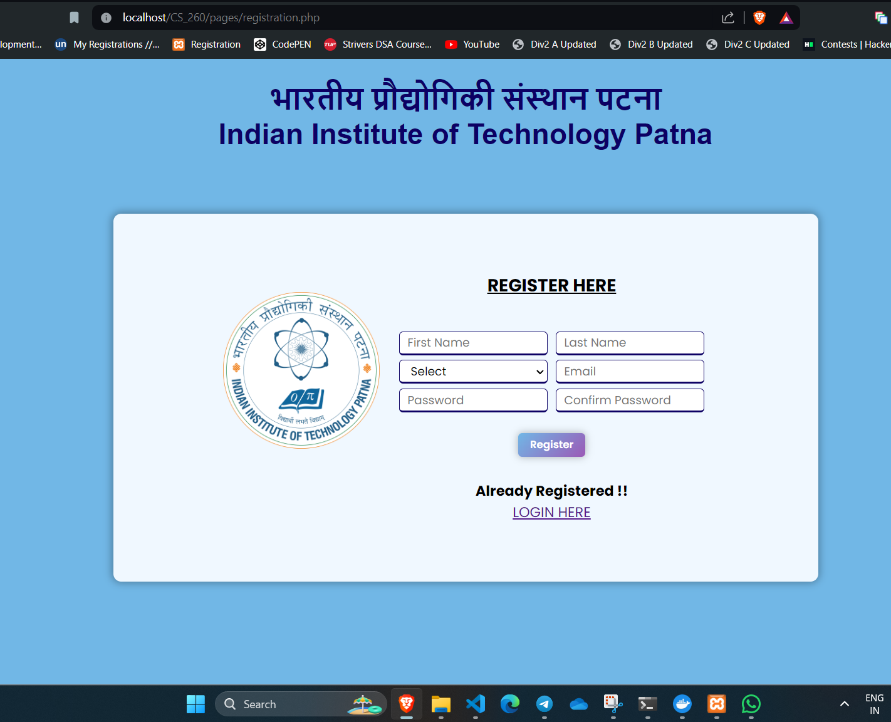
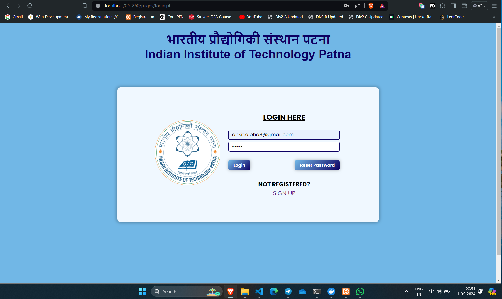
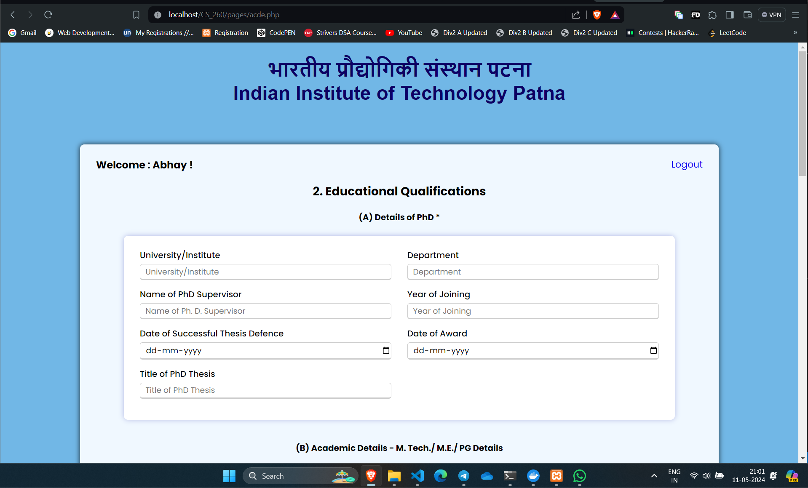
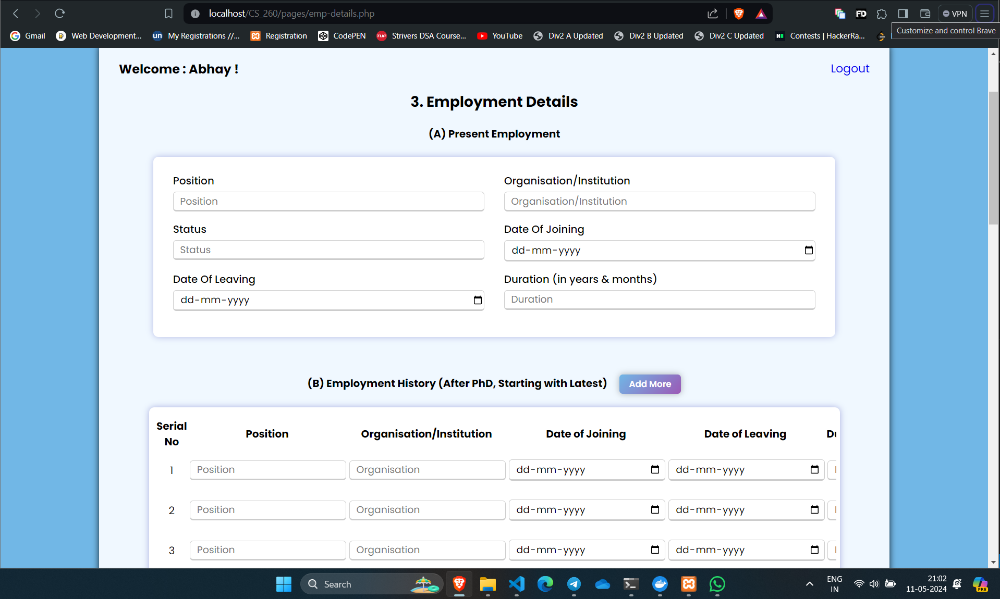
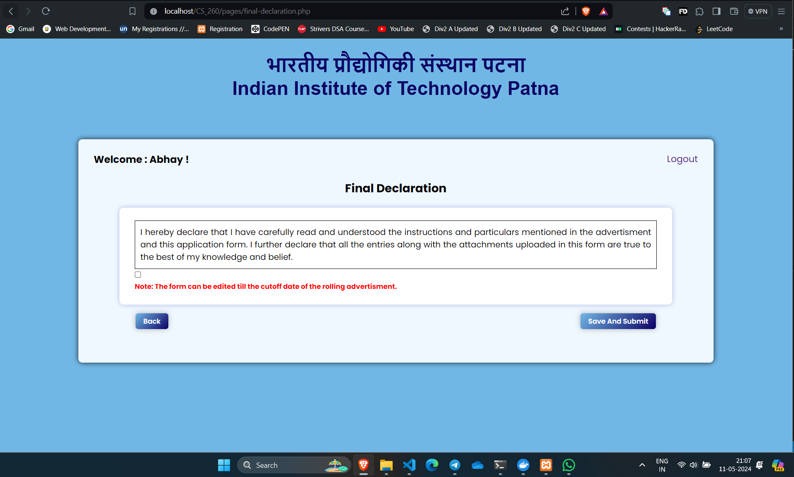
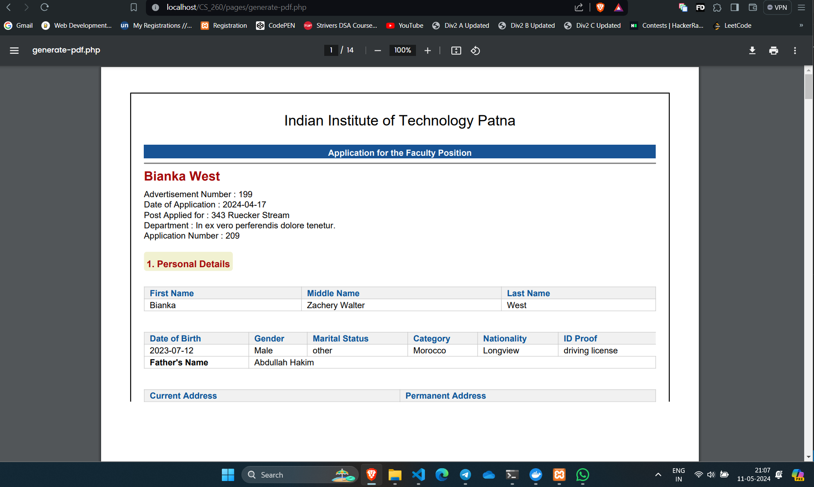

# Faculty Recruitment Portal

Faculty Recruitment Portal is a web application developed using HTML, CSS, JavaScript, PHP, and MySQL. It provides a platform for managing faculty recruitment processes efficiently.


## Technologies Used

- **Frontend**: HTML, CSS, JavaScript
- **Backend**: PHP
- **Database**: MySQL
- **PDF Generation**: DOMPDF
- **Authentication**: phpMailer


## Features

1. **Login and Signin Functionality**: Implemented using phpMailer for secure authentication.

2. **Dynamic Row Addition**: Allows dynamic addition of rows in certain tables, providing flexibility in data entry.

3. **Database Integration**: Data is stored in MySQL database tables corresponding to each page, ensuring organized data management.

4. **PDF Generation**: Utilizes DOMPDF for generating PDF documents, facilitating easy sharing and printing of important information.
   
5. **File Uploading**: Allows to upload files to the website. 


## Usage

1. Clone the repository:

    ```
    https://github.com/Ankit-git463/Faculty-Recruitment-Portal.git

    ```

2. Set up the MySQL database and configure the connection in the PHP files.

3. Install dependencies using Composer (if applicable).

4. Run the application.

## Screenshots

Here are some screenshots of the application:

### Registration Page


### Login Page


### ACDE Page


### Employee Details Page


### Final Declaration Page


### Generated PDF Page



## Youtube link of the Video
 https://youtu.be/znlFqzg2ygI?si=0q2KhzNYYojpuPQ4 
